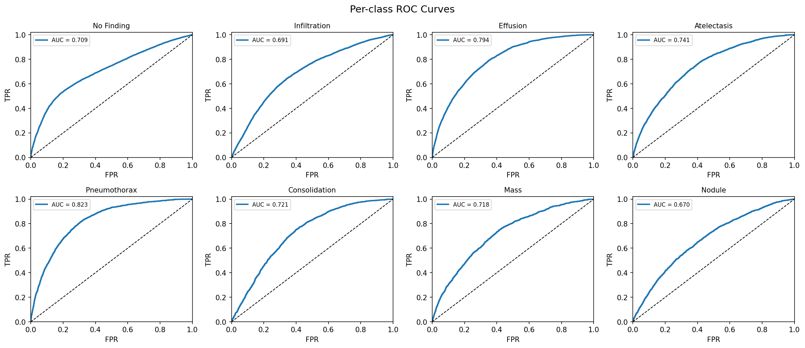
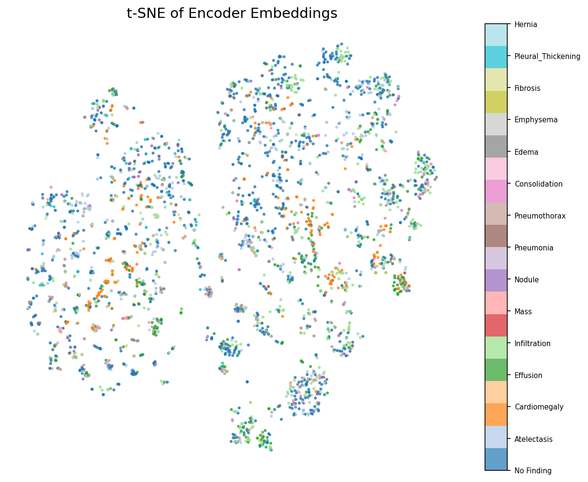
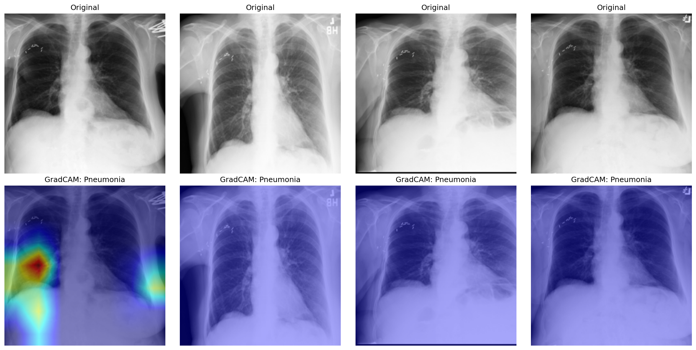
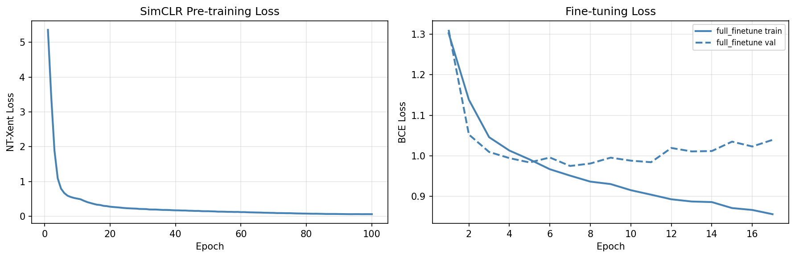

# Contrastive Learning for Medical Image Classification

Self-supervised pre-training with **SimCLR** on the **NIH Chest X-ray14** dataset, followed by supervised fine-tuning for multi-label pathology classification.

---

## Overview

This project demonstrates how contrastive self-supervised learning (SSL) can learn rich medical image representations **without labels**, which are then fine-tuned for downstream classification. The key advantage: SimCLR pre-training uses all 112k images (labels not needed), while supervised methods are limited to labelled training data.

### Pipeline

```
Raw X-ray images
      │
      ▼
[SimCLR Pre-training]          ← self-supervised, no labels used
  Configurable encoder
  + Projection head (MLP)
  + NT-Xent contrastive loss
      │
      ▼  (projection head discarded)
[Fine-tuning]                  ← supervised, multi-label BCE loss
  Pre-trained encoder
  + Classification head (MLP)
      │
      ▼
[Evaluation]
  Per-class AUC-ROC, ROC curves, t-SNE, GradCAM
```

### Three comparison modes

| Mode | Encoder init | Backbone frozen? |
|---|---|---|
| `full_finetune` | SimCLR pre-trained | No (end-to-end) |
| `linear_probe` | SimCLR pre-trained | Yes (classifier only) |
| `imagenet_baseline` | ImageNet weights | No |

---

## Dataset

**NIH Chest X-ray14** — 112,120 frontal-view chest X-rays from 30,805 patients.
Source: [kaggle.com/datasets/nih-chest-xrays/data](https://www.kaggle.com/datasets/nih-chest-xrays/data)

**15 labels** (multi-label — one image can have multiple findings):

| Label | Label | Label |
|---|---|---|
| No Finding | Atelectasis | Cardiomegaly |
| Effusion | Infiltration | Mass |
| Nodule | Pneumonia | Pneumothorax |
| Consolidation | Edema | Emphysema |
| Fibrosis | Pleural Thickening | Hernia |

---

## Supported Backbones

The encoder is configurable via the `backbone` field in config files. All backbones are automatically adapted for single-channel grayscale input.

| Family | Backbone | Feature dim |
|---|---|---|
| ResNet | `resnet18` | 512 |
| ResNet | `resnet34` | 512 |
| ResNet | `resnet50` (default) | 2048 |
| ResNet | `resnet101` | 2048 |
| EfficientNet | `efficientnet_b0` | 1280 |
| EfficientNet | `efficientnet_b1` | 1280 |
| EfficientNet | `efficientnet_b2` | 1408 |
| ViT | `vit_b_16` | 768 |
| ViT | `vit_b_32` | 768 |
| ViT | `vit_l_16` | 1024 |

The projection head and classification head automatically adapt to the backbone's feature dimension.

---

## Project Structure

```
Contrastive_Learning/
│
├── README.md
├── requirements.txt
├── .gitignore
│
├── configs/
│   ├── pretrain_config.yaml      # SimCLR hyperparameters
│   ├── finetune_config.yaml      # Fine-tuning hyperparameters
│   └── data_config.yaml          # Dataset paths and class names
│
├── scripts/
│   ├── download_data.sh          # Kaggle API download + preprocessing
│   ├── run_pretrain.sh           # Launch pre-training
│   ├── run_finetune.sh           # Launch fine-tuning
│   └── run_eval.sh               # Launch evaluation
│
├── src/
│   ├── data/
│   │   ├── augmentations.py      # SimCLR + finetune augmentation pipelines
│   │   ├── dataset.py            # SimCLRDataset, ChestXrayDataset
│   │   ├── preprocess.py         # Build patient-level train/val/test splits
│   │   └── compute_norm_stats.py # Compute dataset-specific mean/std
│   │
│   ├── models/
│   │   ├── encoder.py            # Multi-backbone encoder with registry
│   │   ├── projection_head.py    # 2-layer MLP projection head (SimCLR)
│   │   └── classifier.py         # Multi-label classification head
│   │
│   ├── losses/
│   │   └── nt_xent.py           # NT-Xent contrastive loss
│   │
│   ├── training/
│   │   ├── pretrain.py          # SimCLR pre-training loop
│   │   ├── finetune.py          # Supervised fine-tuning loop
│   │   └── utils.py             # Device selection, checkpointing, LR schedules, seeding
│   │
│   └── evaluation/
│       ├── metrics.py           # AUC-ROC, Average Precision, F1
│       └── visualize.py         # t-SNE, ROC curves, GradCAM, loss curves
│
├── train_pretrain.py             # Entry point: SimCLR pre-training
├── train_finetune.py             # Entry point: fine-tuning / linear probe
├── evaluate.py                   # Entry point: test set evaluation + plots
├── export_model.py               # Entry point: ONNX / TorchScript export
│
├── notebooks/
│   ├── 01_data_exploration.ipynb    # Class distribution, sample images
│   ├── 02_augmentation_preview.ipynb # Visualise augmentation pairs
│   └── 03_results_analysis.ipynb    # ROC curves, t-SNE, metrics table
│
├── data/
│   ├── raw/                      # Downloaded dataset (gitignored)
│   └── processed/                # Generated CSV splits + norm_stats.json (gitignored)
│
├── checkpoints/
│   ├── pretrain/                 # Saved encoder + resume checkpoints
│   └── finetune/                 # Saved classifier + resume checkpoints
│
├── exports/                      # Exported ONNX / TorchScript models
│
└── logs/                         # Training logs and output figures
```

---

## Setup

### 1. Clone / navigate to the project

```bash
cd /path/to/Contrastive_Learning
```

### 2. Create a virtual environment (recommended)

```bash
python3 -m venv venv
source venv/bin/activate        # macOS / Linux
# venv\Scripts\activate         # Windows
```

### 3. Install dependencies

```bash
pip install -r requirements.txt
```

> **Apple Silicon (M1/M2/M3):** PyTorch MPS backend is automatically detected and used. No extra steps needed.
> **CUDA GPU:** Install the appropriate `torch` version from [pytorch.org](https://pytorch.org/get-started/locally/).

### 4. Set up Kaggle API credentials

1. Go to [kaggle.com/settings](https://www.kaggle.com/settings) → **API** → **Create New Token**
2. Move the downloaded `kaggle.json` to `~/.kaggle/`:
   ```bash
   mkdir -p ~/.kaggle
   mv ~/Downloads/kaggle.json ~/.kaggle/kaggle.json
   chmod 600 ~/.kaggle/kaggle.json
   ```
3. Accept the dataset terms at [kaggle.com/datasets/nih-chest-xrays/data](https://www.kaggle.com/datasets/nih-chest-xrays/data) (required before downloading)

---

## Running the Project

### Step 1 — Download data and build splits

```bash
bash scripts/download_data.sh
```

This will:
- Download the full NIH Chest X-ray14 dataset (~45 GB) to `data/raw/`
- Run `src/data/preprocess.py` to create patient-level `train.csv`, `val.csv`, `test.csv` in `data/processed/`

> **Patient-level splitting:** All images from the same patient are kept in the same split to prevent data leakage. The official NIH test list is used as the test split.

### Step 2 — Compute dataset normalization stats (recommended)

```bash
python -m src.data.compute_norm_stats
```

This computes the true mean and standard deviation of the chest X-ray dataset and saves them to `data/processed/norm_stats.json`. Training scripts load these automatically when `normalize_mean` / `normalize_std` are set to `"auto"` in the config (the default).

For a faster estimate using a subset:
```bash
python -m src.data.compute_norm_stats --max_samples 5000
```

> If you skip this step, training falls back to ImageNet normalization values (`mean=0.485, std=0.229`) with a warning.

### Step 3 — SimCLR pre-training

```bash
bash scripts/run_pretrain.sh
```

Or with custom arguments:

```bash
python train_pretrain.py --epochs 100 --batch_size 256 --device auto
```

| Argument | Default | Description |
|---|---|---|
| `--config` | `configs/pretrain_config.yaml` | Config file path |
| `--epochs` | 100 | Number of training epochs |
| `--batch_size` | 256 | Batch size (larger = more negatives = better) |
| `--lr` | 3e-4 | Learning rate |
| `--temperature` | 0.1 | NT-Xent temperature τ |
| `--device` | auto | `auto` / `mps` / `cuda` / `cpu` |
| `--seed` | 42 | Random seed for reproducibility |
| `--resume` | — | Path to checkpoint to resume training from |
| `--wandb` | off | Enable Weights & Biases logging |

Checkpoints are saved to `checkpoints/pretrain/`. The best encoder is saved as `best_encoder.pth`.

> **Note:** Pre-training uses ALL images (labels ignored), so even test-split images participate — this is valid because no labels are used.

**Resuming after a crash:**
```bash
python train_pretrain.py --resume checkpoints/pretrain/latest_pretrain.pth
```

### Step 4 — Fine-tune for classification

**Full fine-tuning (recommended):**
```bash
python train_finetune.py --mode full_finetune
```

**Linear probe (backbone frozen):**
```bash
python train_finetune.py --mode linear_probe
```

**ImageNet baseline (for comparison):**
```bash
python train_finetune.py --mode imagenet_baseline
```

Or via the shell script:
```bash
bash scripts/run_finetune.sh --mode full_finetune
```

| Argument | Default | Description |
|---|---|---|
| `--mode` | `full_finetune` | Training mode (see above) |
| `--checkpoint` | from config | Path to pre-trained encoder |
| `--epochs` | 50 | Fine-tuning epochs |
| `--batch_size` | 64 | Batch size |
| `--lr` | 1e-4 | Classifier learning rate |
| `--device` | auto | Device |
| `--seed` | 42 | Random seed for reproducibility |
| `--resume` | — | Path to checkpoint to resume training from |
| `--wandb` | off | Enable Weights & Biases logging |

Best models saved to `checkpoints/finetune/best_model_<mode>.pth`.

**Resuming after a crash:**
```bash
python train_finetune.py --resume checkpoints/finetune/latest_finetune_full_finetune.pth
```

### Step 5 — Evaluate on the test set

```bash
python evaluate.py --checkpoint checkpoints/finetune/best_model_full_finetune.pth
```

Or via the shell script:
```bash
bash scripts/run_eval.sh --checkpoint checkpoints/finetune/best_model_full_finetune.pth
```

**Optional flags:**

| Flag | Description |
|---|---|
| `--no_tsne` | Skip t-SNE (slow for large datasets) |
| `--no_gradcam` | Skip GradCAM generation |
| `--output_dir` | Directory for output figures (default: `logs/`) |
| `--export onnx torchscript` | Export model after evaluation (one or both formats) |
| `--export_dir` | Directory for exported models (default: `exports/`) |

**Outputs saved to `logs/`:**
- `metrics_<mode>.txt` — per-class and macro-averaged AUC-ROC, AP, F1
- `roc_curves.png` — per-class ROC curves
- `tsne.png` — t-SNE of encoder embeddings coloured by pathology
- `gradcam_pneumonia.png` — GradCAM saliency maps
- `loss_curves.png` — pre-training and fine-tuning loss curves

---

## Notebooks

Open Jupyter Lab and run in order:

```bash
jupyter lab notebooks/
```

| Notebook | Description |
|---|---|
| `01_data_exploration.ipynb` | Class distribution, sample X-rays, split verification, pixel statistics |
| `02_augmentation_preview.ipynb` | Side-by-side view of original vs. SimCLR augmented pairs |
| `03_results_analysis.ipynb` | Compare all modes in a metrics table, ROC curves, t-SNE, GradCAM |

---

## Architecture Details

### Encoder (Configurable backbone)

All backbones are adapted for single-channel grayscale input:
- **ResNet family:** First conv `in_channels=3` → `1`; avgpool + FC stripped
- **EfficientNet family:** First conv `in_channels=3` → `1`; classifier stripped
- **ViT family:** Patch embedding conv `in_channels=3` → `1`; classification head stripped

When using ImageNet-pretrained weights, the RGB channel weights are averaged to initialise the single-channel convolution.

Set the backbone in `configs/pretrain_config.yaml`:
```yaml
model:
  backbone: "resnet50"    # or resnet18, efficientnet_b0, vit_b_16, etc.
```

### Projection Head

2-layer MLP used only during pre-training, then discarded:
```
h (feature_dim) → Linear → BN → ReLU → Linear → L2-normalise → z (128)
```

### NT-Xent Loss

For a batch of N images (→ 2N augmented views):

```
L = -log [ exp(sim(zᵢ, zⱼ) / τ) / Σ_{k≠i} exp(sim(zᵢ, zₖ) / τ) ]
```

where `sim` is cosine similarity and `τ = 0.1`. Each view's positive pair is the other augmented view of the same image; all other 2(N-1) views are negatives.

### Augmentation Pipeline (X-ray adapted)

SimCLR augmentations are tuned for grayscale medical images:
- Random resized crop (scale 0.08–1.0)
- Random horizontal flip
- Random rotation (±10°, configurable via `rotation_degrees`)
- Color jitter (brightness + contrast only — no saturation/hue for grayscale)
- Random Gaussian blur
- No `RandomGrayscale` (already grayscale)
- Normalization using dataset-specific stats (computed via `src.data.compute_norm_stats`, or ImageNet fallback)

### Classification Head

```
h (feature_dim) → Linear(512) → BN → ReLU → Dropout(0.3) → Linear(15) → logits
```

- Loss: `BCEWithLogitsLoss` with per-class `pos_weight` for class imbalance
- Sigmoid applied at inference time (threshold = 0.5)
- Differential LR: backbone gets 10× lower LR than classifier head

---

## Reproducibility

All training scripts set a global random seed (default: 42) across Python, NumPy, and PyTorch for reproducible results:

```bash
python train_pretrain.py --seed 42
python train_finetune.py --seed 42
```

This also sets `torch.backends.cudnn.deterministic = True` and `torch.backends.cudnn.benchmark = False` for deterministic CUDA operations.

The seed can be configured via CLI (`--seed`) or in the YAML config (`training.seed`).

---

## Model Export

Export a fine-tuned model to ONNX and/or TorchScript for deployment or optimised inference.

**Standalone export:**
```bash
python export_model.py --checkpoint checkpoints/finetune/best_model_full_finetune.pth
```

**Export after evaluation:**
```bash
python evaluate.py --checkpoint checkpoints/finetune/best_model_full_finetune.pth --export onnx torchscript
```

| Argument | Default | Description |
|---|---|---|
| `--checkpoint` | (required) | Path to fine-tuned model checkpoint |
| `--format` | `onnx torchscript` | Export format(s): `onnx`, `torchscript`, or both |
| `--output_dir` | `exports/` | Directory for exported models |
| `--image_size` | from config | Input image size |
| `--opset` | 17 | ONNX opset version |
| `--device` | cpu | Device for export (CPU recommended for compatibility) |

**Exported files:**
- `exports/<checkpoint_name>.onnx` — ONNX model with dynamic batch size
- `exports/<checkpoint_name>.pt` — TorchScript traced model

Both formats support dynamic batch sizes and are verified against the original model during export. ONNX verification requires the `onnx` package (`pip install onnx`).

---

## Evaluation Results

After completing SimCLR pre-training and supervised fine-tuning, the model is evaluated on the test set.

### 1. ROC Curves
Per-class ROC curves for the top prevalent classes, demonstrating the model's discriminative ability across different pathologies.


### 2. Encoder Embeddings (t-SNE)
t-SNE visualization of the encoder features, colored by the primary pathology. This shows how well the model groups similar images together.


### 3. Grad-CAM Interpretability
Grad-CAM heatmaps overlaying the original X-rays to highlight the regions the model focuses on when predicting specific pathologies (e.g., Pneumonia).


### 4. Training Loss
Loss curves during the pre-training and fine-tuning phases.

