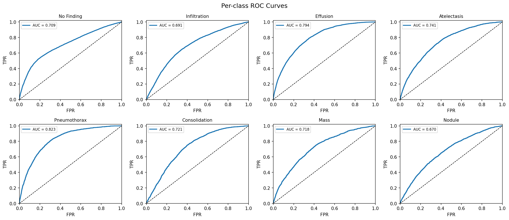
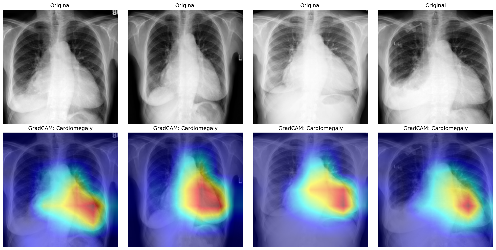
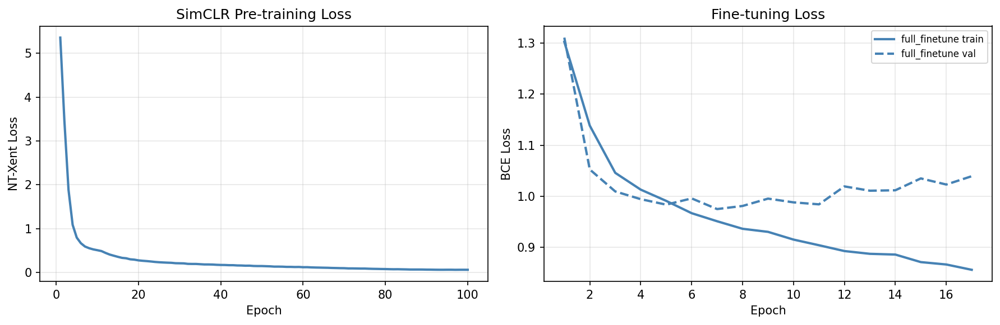

# Contrastive Learning for Medical Image Classification

Self-supervised pre-training with **SimCLR** on the **NIH Chest X-ray14** dataset, followed by supervised fine-tuning for multi-label pathology classification.

## Overview

SimCLR learns image representations without labels by pulling two augmented views of the same X-ray together in embedding space (NT-Xent loss) while pushing apart views of different X-rays. The pre-trained encoder is then fine-tuned for 15-way multi-label classification.

```
Raw X-ray images
      │
      ▼
[SimCLR Pre-training]     self-supervised: encoder + projection head + NT-Xent loss
      │                   (projection head discarded afterwards)
      ▼
[Fine-tuning]             supervised: encoder + MLP head, multi-label BCE loss
      │
      ▼
[Evaluation]              per-class AUC-ROC, ROC curves, GradCAM
```

Three modes let you compare SimCLR against baselines:

| Mode | Encoder init | Backbone frozen? |
|---|---|---|
| `full_finetune` | SimCLR pre-trained | No (end-to-end) |
| `linear_probe` | SimCLR pre-trained | Yes (classifier only) |
| `imagenet_baseline` | ImageNet weights | No |

## Dataset

**NIH Chest X-ray14** — 112,120 frontal-view chest X-rays from 30,805 patients, 15 labels (multi-label: No Finding, Atelectasis, Cardiomegaly, Effusion, Infiltration, Mass, Nodule, Pneumonia, Pneumothorax, Consolidation, Edema, Emphysema, Fibrosis, Pleural Thickening, Hernia).
Source: [kaggle.com/datasets/nih-chest-xrays/data](https://www.kaggle.com/datasets/nih-chest-xrays/data)

Splits are **patient-level** (all images of a patient stay in one split) using the official NIH test list. Pre-training uses only the ~86k train/val images — the test split is excluded even though no labels are used, to avoid transductive leakage.

## Project Structure

```
configs/            pretrain_config.yaml, finetune_config.yaml
scripts/            download_data.sh, run_pretrain.sh, run_finetune.sh, run_eval.sh
src/
  data/             augmentations, datasets, split building, norm stats
  models/           encoder (multi-backbone), projection head, classifier
  losses/           NT-Xent contrastive loss
  training/         pre-training loop, fine-tuning loop, shared utils
  evaluation/       metrics (AUC/AP/F1), ROC + GradCAM + loss-curve plots
notebooks/          01_data_exploration, 02_augmentation_preview, 03_results_analysis
train_pretrain.py   entry point: SimCLR pre-training
train_finetune.py   entry point: fine-tuning / linear probe / ImageNet baseline
evaluate.py         entry point: test-set evaluation + plots (+ optional export)
export_model.py     entry point: ONNX / TorchScript export
```

Generated artifacts go to `data/` (raw + processed, gitignored), `checkpoints/`, `logs/`, and `exports/`.

## Setup

```bash
python3 -m venv venv
source venv/bin/activate        # Windows: venv\Scripts\activate
pip install -r requirements.txt
```

Apple Silicon (MPS) is auto-detected; for CUDA install the matching `torch` build from [pytorch.org](https://pytorch.org/get-started/locally/).

**Kaggle credentials** (needed for the download script): create an API token at [kaggle.com/settings](https://www.kaggle.com/settings), place `kaggle.json` in `~/.kaggle/` (`chmod 600`), and accept the dataset terms on its Kaggle page.

## Usage

All entry points accept `--help` for the full list of flags; common overrides are `--epochs`, `--batch_size`, `--lr`, `--device`, `--seed`, `--resume`, and `--wandb`. Defaults live in `configs/*.yaml`.

**1. Download data (~45 GB) and build splits**

```bash
bash scripts/download_data.sh
```

**2. Compute dataset normalization stats** (recommended; otherwise training falls back to ImageNet values with a warning)

```bash
python -m src.data.compute_norm_stats            # add --max_samples 5000 for a fast estimate
```

**3. SimCLR pre-training** — best encoder saved to `checkpoints/pretrain/best_encoder.pth`

```bash
python train_pretrain.py
python train_pretrain.py --resume checkpoints/pretrain/latest_pretrain.pth   # resume after a crash
```

**4. Fine-tune** — best model saved to `checkpoints/finetune/best_model_<mode>.pth`

```bash
python train_finetune.py --mode full_finetune      # or linear_probe | imagenet_baseline
python train_finetune.py --resume checkpoints/finetune/latest_finetune_full_finetune.pth
```

**5. Evaluate on the test set**

```bash
python evaluate.py --checkpoint checkpoints/finetune/best_model_full_finetune.pth
```

Outputs to `logs/`: `metrics_<mode>.txt` (per-class + macro AUC-ROC / AP / F1), `roc_curves.png`, `gradcam_cardiomegaly.png`, `loss_curves.png`. Add `--no_gradcam` to skip saliency maps, or `--export onnx torchscript` to export the model afterwards.

**Model export** (standalone) — writes `exports/<name>.onnx` and/or `exports/<name>.pt`, both with dynamic batch size and verified against the original model:

```bash
python export_model.py --checkpoint checkpoints/finetune/best_model_full_finetune.pth
```

## Architecture Notes

**Encoder** — configurable via `model.backbone` in the configs. All backbones are adapted for single-channel grayscale input (first conv `in_channels: 3 → 1`; when using ImageNet weights the RGB kernels are averaged) and have their classification heads stripped. The projection and classification heads adapt to the backbone's feature dimension automatically.

| Family | Backbones | Feature dim |
|---|---|---|
| ResNet | `resnet18` (default), `resnet34` | 512 |
| ResNet | `resnet50`, `resnet101` | 2048 |
| EfficientNet | `efficientnet_b0`, `efficientnet_b1` | 1280 |
| EfficientNet | `efficientnet_b2` | 1408 |
| ViT | `vit_b_16`, `vit_b_32` | 768 |
| ViT | `vit_l_16` | 1024 |

**Projection head** — 2-layer MLP (`Linear → BN → ReLU → Linear → L2-normalise`, output dim 128), used only during pre-training and then discarded, per the SimCLR paper.

**NT-Xent loss** — for N images (2N views), each view's positive is the other view of the same image; the remaining 2(N−1) views are in-batch negatives. Cosine similarity with temperature τ = 0.1.

**Augmentations (X-ray adapted)** — random resized crop, rotation (±10°), brightness/contrast jitter (no saturation/hue — grayscale), Gaussian blur. **No horizontal flip**: chest anatomy is lateralized (heart on the left), and flip-invariance erases laterality cues needed for findings like Cardiomegaly (`horizontal_flip_prob` is configurable for ablations). Normalization uses dataset-specific stats from step 2.

**Classifier head** — `Linear(512) → BN → ReLU → Dropout(0.4) → Linear(15)`, trained with `BCEWithLogitsLoss` + per-class `pos_weight` for class imbalance and a 10× lower learning rate on the backbone. Because `pos_weight` decalibrates logits, evaluation tunes per-class F1 thresholds on the **validation** set and applies them to the test set (AUC-ROC and AP are threshold-free).

**Reproducibility** — a global seed (default 42, via `--seed` or `training.seed`) covers Python, NumPy, and PyTorch, with deterministic cuDNN enabled.

## Results

Evaluated on the official 25,596-image test set. Default configuration: ResNet18 encoder, SimCLR pre-training at batch size 256 with mixed precision, then full fine-tuning.

| Metric (`full_finetune`) | Value |
|---|---|
| Macro AUC-ROC | N/A |
| Macro Average Precision | N/A |
| Macro F1 (val-tuned thresholds) | N/A |

See `logs/metrics_full_finetune.txt` for the per-class table.

**ROC curves** — per-class curves for the most prevalent pathologies:



**Grad-CAM** — saliency overlays showing where the model looks when predicting Cardiomegaly:



**Training loss** — left: SimCLR NT-Xent loss over pre-training; right: fine-tuning train/val BCE loss, where strong regularization (dropout 0.4, weight decay 5e-2, jitter + random erasing) keeps the curves close and early stopping halts on val-loss plateau:


